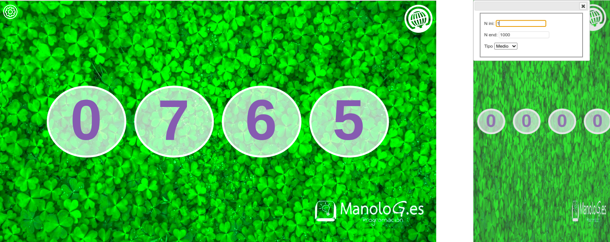

## Sencilla aplicación web de Rifa

La idea surge de cuando una amiga me tiene que hacer una rifa y no encuentra ninguna
aplicación para el movil, que lo permita o las que encuentra le piden muchos permiso
extraños al instalarla.

Se me ocurre programar una pagina web, que ni siquiera es necesario instalarse,
entrando a la url para usarla.

demo en https://rifa.manolog.es

Es una sencilla aplicación con elementos de PWA para que tenga un formato instalable
en el movil, realizada en javascript que permite hacer un sorteo, es
 decir, genera números aleatorios y los muestra en un formato visual que parece
 una rifa tradicional, permite marcar el intervalo en el que se mueven los numeros.

25/09/2018

